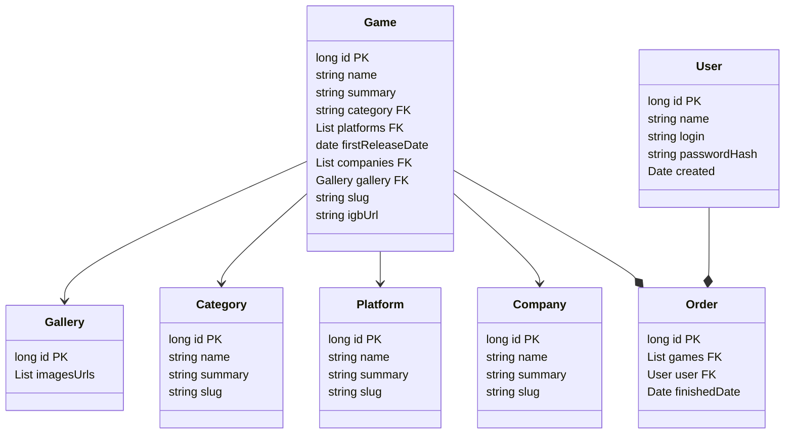

# Database documentation

This document contains information about database type, schema and models.

## DB Selection process

### SQL vs noSQL

Trying to deliver fast enough to find, edit and save system elements required selecting the appropriate database. In my experience, SQL databases and normalized (on useful level) data are ideal for such situations.

The problem to be solved requires the use of **structured data** (Game,  Purchase). Use cases illustrate behaviors that, in order to facilitate and speed up the operation of the system, can be written as **relationships** between data.

Selection: SQL DB

### MySQL vs PostgreSQL

The finishing the order is a process which should be implemented transactional (Acid compliance). The data is structured and additional e.g JSON feathers are not needed. Probably won't be need very complicated queries.

I think both of engines are good to this task. So I want to try database which I never cooperate in Java environment.

Selection: PostgreSQL

## DB schema and models

